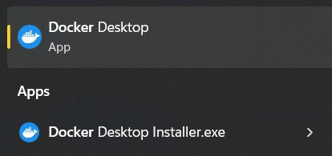
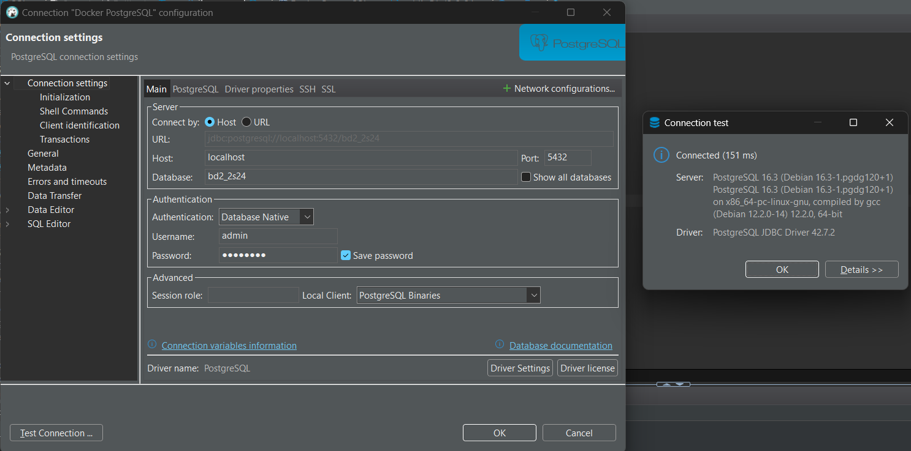

# Clase 1-2 Introducción a las transacciones y herramientas del curso

En esta clase, exploraremos los conceptos fundamentales de las transacciones y las herramientas que utilizaremos a lo largo del curso. Comenzaremos con una revisión de los principios teóricos, seguida de la instalación y configuración de las herramientas esenciales como el cliente SQL y Docker Desktop. Además, aprenderemos a crear y gestionar contenedores Docker para PostgreSQL, asegurando un entorno de desarrollo robusto y eficiente.

## Presentaciones del curso (teoría)

[Clase 1](https://www.canva.com/design/DAGL0dx94lA/CCUEuKefnn6emOkwPNIj2g/view?utm_content=DAGL0dx94lA&utm_campaign=designshare&utm_medium=link&utm_source=editor)

[Clase 2](https://www.canva.com/design/DAGMA2pUaIc/RNVWPSgmMMk3jbrQCwQC1w/edit?utm_content=DAGMA2pUaIc&utm_campaign=designshare&utm_medium=link2&utm_source=sharebutton)


## Instalación de herramientas

### Cliente SQL


### Docker Desktop (Windows)

**Recomendación:** realizar instalación con wsl2.



## Configuración Docker 

### Creación de carpetas y configuraciones iniciales


* **Carpeta backup (de momento obligatoria):** contiene logs de WAL archivados para respaldos y recuperación.
* **Carpeta pg1-path (de momento obligatoria):** contiene la estructura de directorios y archivos de datos de PostgreSQL, crucial para el funcionamiento y almacenamiento de la base de datos.

### Creación de Dockerfile

```dockerfile
# Usa la imagen oficial de PostgreSQL
FROM postgres:latest

# Variables de entorno para la configuración de PostgreSQL
ENV POSTGRES_USER=admin
ENV POSTGRES_PASSWORD=root1234
ENV POSTGRES_DB=bd2_2s24

# Crear directorio para los backups
RUN mkdir -p /backups

# Configurar el archivo postgresql.conf para habilitar el modo WAL y el archivado
RUN echo "wal_level = replica" >> /usr/share/postgresql/postgresql.conf.sample
RUN echo "archive_mode = on" >> /usr/share/postgresql/postgresql.conf.sample
RUN echo "archive_command = 'test ! -f /backups/%f && cp %p /backups/%f'" >> /usr/share/postgresql/postgresql.conf.sample

# Instalar pgBackRest
RUN apt-get update && apt-get install -y pgbackrest

# Crear directorio para la configuración de pgBackRest
RUN mkdir -p /etc/pgbackrest

# Copiar el archivo de configuración de pgBackRest al contenedor
COPY pgbackrest.conf /etc/pgbackrest/pgbackrest.conf

## Instalar pgAgent para evitar error de extensión no encontrada (línea 29-33)

RUN apt-get update && apt-get install -y pgagent

# Script para crear la extensión pgAgent después de iniciar PostgreSQL
COPY create_pgagent_extension.sh /docker-entrypoint-initdb.d/create_pgagent_extension.sh
RUN chmod +x /docker-entrypoint-initdb.d/create_pgagent_extension.sh

# Crear un directorio para scripts de inicialización (opcional)
# COPY init.sql /docker-entrypoint-initdb.d/

# Exponer el puerto PostgreSQL
EXPOSE 5432

# Comando para ejecutar PostgreSQL
CMD ["postgres"]
```

### Creación de imagen 

**Nota:** (ejecutar comando al mismo nivel de donde se encuentre el Dockerfile)

```sh
docker build -t custom-postgres .
```

### Creación de contenedor

**Nota:** los saltos de línea son con **`** porque se ejecuta comando en powershell. Tomar en cuenta cambio en cmd, unix/linux/bash, etc...

#### Plantilla: 
```sh
docker run -d `
  --name postgres `
  -v /ruta/local/a/tu/data:/var/lib/postgresql/data `
  -v /ruta/local/a/tus/backups:/backups `
  -p 5432:5432 `
  custom-postgres
```

#### Ejemplo:

```shell
docker run -d `
  --name postgres `
  -v C:\proyectos\BD2_2S24_PRIVADO\src\pg1-path:/var/lib/postgresql/data `
  -v C:\proyectos\BD2_2S24_PRIVADO\src\backup:/backups `
  -p 5432:5432 `
  custom-postgres
```

## Configuración y prueba de conexión



