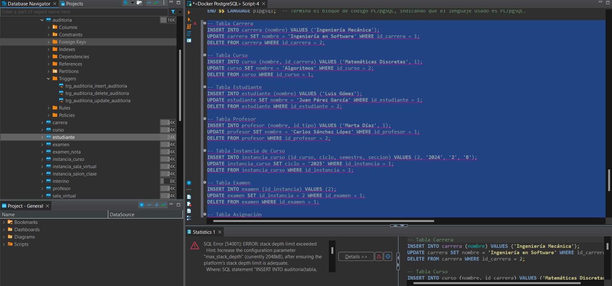
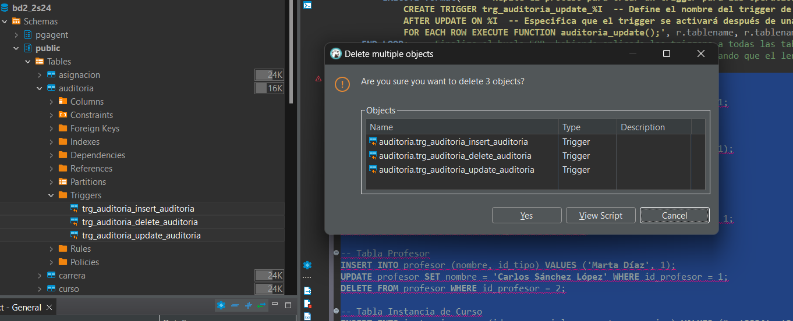

# Clase 4 Procedimientos, funciones y triggers con transacciones

## Esquema de base de datos


## Actualización del Dockerfile

Se actualizó el Dockerfile para que se muestran de forma detallada los logs en postgreSQL, para poder visualizar mejor las transacciones.

```dockerfile
# Configurar PostgreSQL para habilitar los logs detallados
RUN echo "log_min_messages = info" >> /var/lib/postgresql/data/postgresql.conf
RUN echo "client_min_messages = notice" >> /var/lib/postgresql/data/postgresql.conf
RUN echo "log_statement = 'all'" >> /var/lib/postgresql/data/postgresql.conf
RUN echo "log_duration = on" >> /var/lib/postgresql/data/postgresql.conf
```

## Creación de script para limpieza de bind volumes

Script para limpiar carpetas de forma más fácil, asociadas como volumens del servidor de postgreSQL.

dar permisos de ejecución siempre (Powerwhell)

luego ejecutar
```shell
.\clean_bind_volumes.ps1
```

## Posibles errores que se presenten

### ERROR: stack depth limit exceeded

#### Definición

indica que PostgreSQL ha alcanzado el límite de profundidad de la pila, lo cual suele ocurrir cuando se produce una recursión infinita o un bucle de llamadas que no puede resolverse.

#### Caso / Situación

Cuando se ejecute el script de insertions, uploads and deletes. Es posible, que surja este error. Ya que en ese momento en particular la tabla *auditoria* cuenta con los triggers que se crearon de forma dinámica. Por lo que, hay que eliminar dichos triggers de la tabla cada vez que se ejecute dicho bloque.



#### Solución

Bastaría con eliminar los triggers de la tabla *auditoria*.



