# MONGODB CON DOCKER

## Prerequisitos (Windows - opcional)

1. Instalar Docker Desktop
2. Habilitar WSL2
3. Instalar WSL2
4. Instalar Mongosh (MongoDb Shell)

### Pasos para instalar Mongosh (Opcional)

#### 1. Descargar el instalador (MSI) de la página oficial de MongoDB

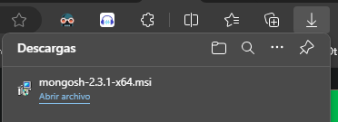

https://www.mongodb.com/docs/mongodb-shell/install/

https://www.mongodb.com/try/download/shell

#### 2. Ejecutar el instalador y seguir los pasos

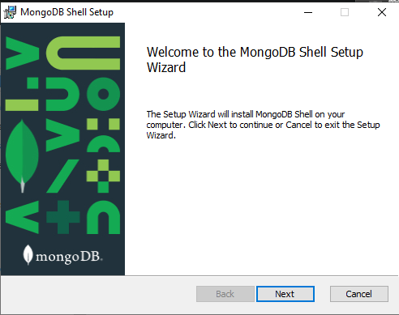

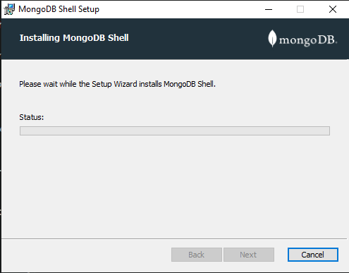

## Pasos para instalar MongoDB con Docker (2 formas)

### 1. Forma 1

#### 1.1. Pull the MongoDB Docker Image
````bash
docker pull mongodb/mongodb-community-server:latest
````

#### 1.2. Run the Image as a Container

````bash
docker run --name mongodb -p 27017:27017 -d mongodb/mongodb-community-server:latest
````

#### 1.3. Verify the Container is Running

````bash
docker ps
````

### 2. Forma 2

#### 2.1. Using Docker-Compose

*Nota: * siempre tomar en cuenta modificar la ruta del volumen si se desea otra.

```bash
docker-compose up -d
```

### 3 Verificar que el contenedor está corriendo

```bash
docker ps
```

### 4.1. Connect to the MongoDB Container (Mongosh)

````bash
mongosh --port 27017
````

### 4.2. Connect to the MongoDB Container (Docker/Dbeaver)

#### 4.2.1. Si no aparece MongoDb en la lista de conexiones, hay que instalar el driver correspondiente.

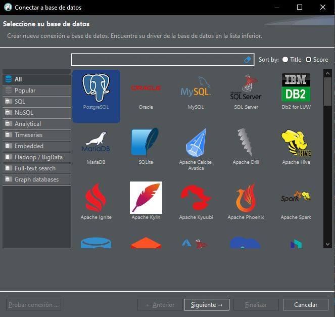

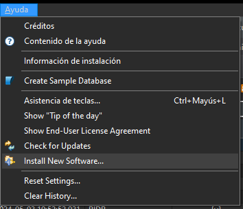

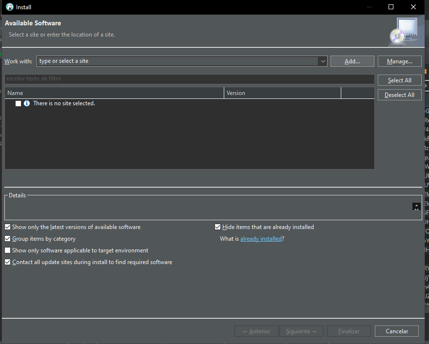

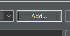

#### 4.2.2. Introducir la siguiente url de driver en "Location" y hacer clic en "Download"

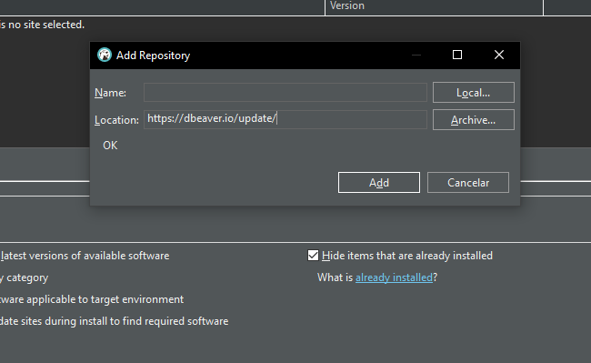

#### 4.2.2. Otra opción es descargar e instalar la versión pro o academica de Dbeaver.

https://dbeaver.com/academic-license/


### 4.2.1. Conectar a la base de datos

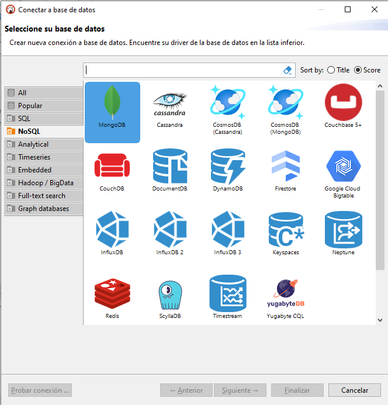

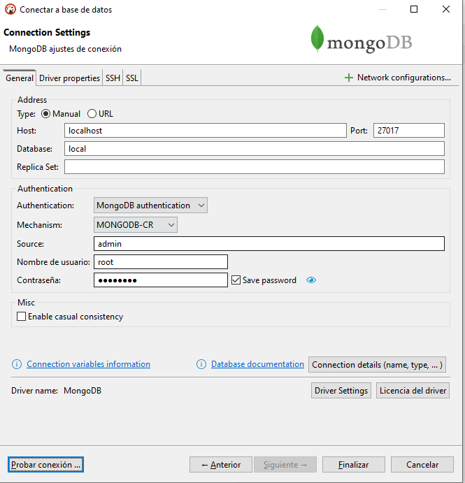

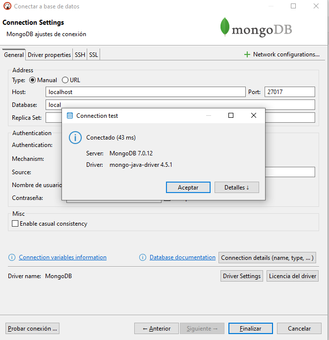


## Fuentes

https://www.mongodb.com/docs/manual/tutorial/install-mongodb-community-with-docker/?msockid=1c89de47c56c69132c7eca8bc470688f