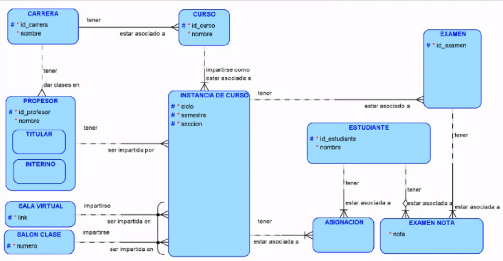

# Clase 2 - Transacciones y Concurrencia en SQL Avanzado

En esta sección aprenderemos sobre las transacciones en SQL, cómo funcionan y cómo se pueden controlar para evitar problemas de concurrencia. También veremos cómo se pueden optimizar las transacciones y los desafíos que se presentan en transacciones distribuidas. Adicional, como se relacionan con las propiedades ACID y los niveles de aislamiento en SQL.

## Transacciones en SQL

Una transacción es una secuencia de operaciones que se ejecutan como una sola unidad de trabajo. Si una de las operaciones falla, la transacción se deshace y se restaura a un estado anterior. Las transacciones en SQL se utilizan para garantizar la integridad de los datos y para evitar problemas de concurrencia.

### Propiedades ACID

Las transacciones en SQL deben cumplir con las propiedades ACID para garantizar la integridad de los datos y la consistencia de la base de datos. Estas propiedades son:

- **Atomicidad**: Una transacción debe ser atómica, es decir, se ejecuta como una sola unidad de trabajo. Si una de las operaciones falla, la transacción se deshace y se restaura a un estado anterior.

- **Consistencia**: Una transacción debe mantener la consistencia de la base de datos, es decir, garantizar que los datos estén en un estado válido en todo momento.

- **Aislamiento**: Una transacción debe ser aislada de otras transacciones, es decir, no debe interferir con otras transacciones en ejecución.

- **Durabilidad**: Una transacción debe ser duradera, es decir, una vez que se ha completado, los cambios realizados por la transacción deben ser permanentes y no se pueden deshacer.

### Niveles de Aislamiento

Los niveles de aislamiento en SQL controlan cómo se comportan las transacciones en relación con otras transacciones en ejecución. Los niveles de aislamiento más comunes son:

- **READ UNCOMMITTED**: Permite leer datos no confirmados por otras transacciones.
- **READ COMMITTED**: Solo permite leer datos confirmados por otras transacciones.
- **REPEATABLE READ**: Garantiza que los datos leídos no cambiarán durante la transacción.
- **SERIALIZABLE**: Garantiza que las transacciones se ejecuten en serie, evitando problemas de concurrencia.

## Concurrencia en SQL

La concurrencia en SQL se refiere a la capacidad de múltiples transacciones para acceder y modificar los mismos datos al mismo tiempo. La concurrencia puede causar problemas como lecturas sucias, lecturas no repetibles y escrituras fantasma. Para evitar estos problemas, se pueden utilizar bloqueos y controles de concurrencia.

### Bloqueos

Los bloqueos en SQL se utilizan para controlar el acceso a los datos y evitar problemas de concurrencia. Los bloqueos pueden ser de varios tipos, como bloqueos de lectura, bloqueos de escritura y bloqueos de actualización. Los bloqueos se pueden aplicar a nivel de fila, página o tabla, dependiendo de la granularidad requerida.

### Controles de Concurrencia

Además de los bloqueos, se pueden utilizar otros controles de concurrencia para evitar problemas de concurrencia, como la serialización de transacciones, la optimización de consultas y la gestión de transacciones distribuidas. Estos controles pueden ayudar a mejorar el rendimiento y la escalabilidad de las aplicaciones SQL.

## Ejemplo práctico	

### Requisitos

Para seguir este ejemplo práctico, necesitarás tener instalado postgresql en tu máquina. Para esto puedes seguir las instrucciones de la Clase #1.

[Clase #1](../Clase#1-Introducción_SQL/README.md)

### Esquema de base de datos (ERD)

Este es el esquema de la base de datos que utilizaremos en este ejemplo práctico y probablemente en otros ejemplos más adelante.

### Instrucciones 

Ejecutar paso a paso los scripts de la carpetas correspondientes según el orden indicado en los scripts. Cada script .sql contiene comentarios explicativos de lo que se está realizando en cada paso.

