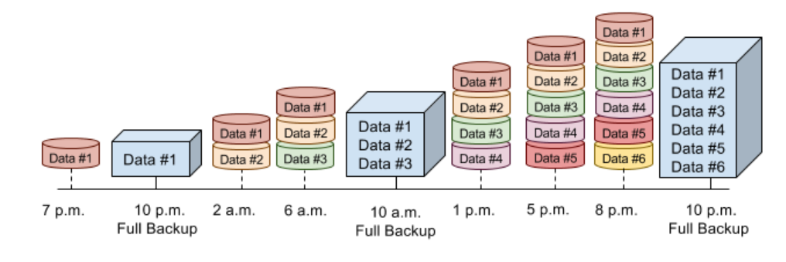
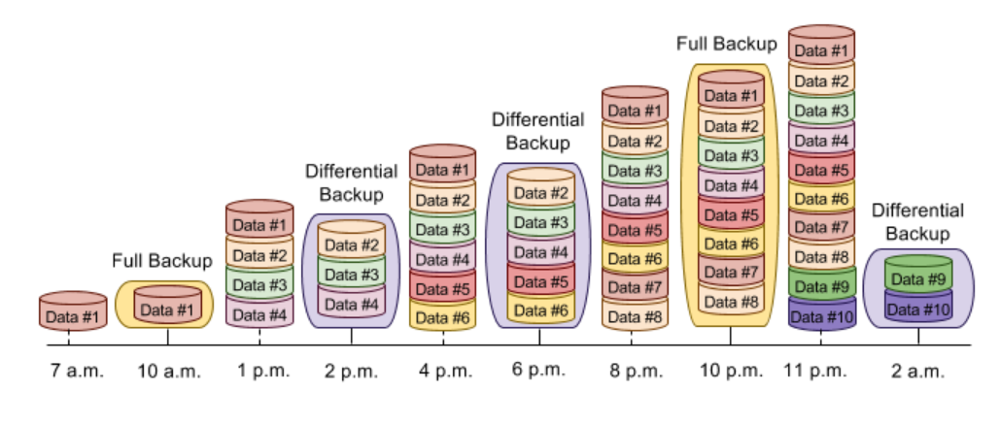

# Clase #3 - Introducción a los Backups y Respaldos

En esta clase se abordarán los siguientes temas: 

- Introducción a los diferentes tipos de respaldo: completo, incremental y diferencial
- Estrategias de respaldo según el tamaño y uso de la base de datos
- Herramientas de respaldo: ventajas y desventajas de diferentes soluciones
- Automatización de respaldos: creación de scripts para realizar respaldos regulares
- Planificación de respaldos: cómo definir la frecuencia adecuada
- Recuperación a partir de diferentes tipos de respaldos
- Ejercicio práctico: implementación de un plan de respaldo en un entorno de prueba utilizando pgdump (postgresql), generando un backup completo con restauración en caliente.

## Introducción a los diferentes tipos de respaldo

### Respaldo Completo



- Copia de todos los datos de la base de datos
- Se realiza de forma periódica
- Permite recuperar la base de datos en su totalidad
- Ventajas: fácil de implementar, rápida recuperación
- Desventajas: consume más espacio de almacenamiento, requiere más tiempo de ejecución

### Respaldo Incremental


- Copia de los datos que han cambiado desde el último respaldo
- Se realiza de forma periódica
- Permite recuperar la base de datos a partir de un punto específico
- Ventajas: consume menos espacio de almacenamiento, menor tiempo de ejecución
- Desventajas: recuperación más compleja, dependencia de respaldos anteriores

### Respaldo Diferencial



- Copia de los datos que han cambiado desde el último respaldo completo
- Se realiza de forma periódica
- Permite recuperar la base de datos a partir del último respaldo completo
- Ventajas: consume menos espacio de almacenamiento, recuperación más rápida
- Desventajas: recuperación más compleja, dependencia de respaldos anteriores

## Estrategias de respaldo según el tamaño y uso de la base de datos

### Base de Datos Pequeña

- Respaldo completo diario
- Respaldo incremental o diferencial cada hora

### Base de Datos Mediana

- Respaldo completo diario
- Respaldo incremental o diferencial cada 6 horas

### Base de Datos Grande

- Respaldo completo diario
- Respaldo incremental o diferencial cada 12 horas

## Herramientas de respaldo: ventajas y desventajas de diferentes soluciones

### pg_dump

- Herramienta de respaldo nativa de PostgreSQL
- Permite realizar respaldos completos o de esquemas específicos
- Ventajas: fácil de usar, compatible con diferentes versiones de PostgreSQL
- Desventajas: no es escalable para bases de datos grandes, no soporta respaldos incrementales

### pgBackRest

- Herramienta de respaldo externa para PostgreSQL
- Permite realizar respaldos completos, incrementales y diferenciales
- Ventajas: escalable para bases de datos grandes, soporta respaldos incrementales
- Desventajas: requiere configuración adicional, no es compatible con todas las versiones de PostgreSQL

## Full Backup PostgreSQL (Método 1: pgdump)

### Creación Full Backup

Plantilla Comando (**Recordar que estos comandos son ejecutados en powershell** por lo que la función de las fechas puede varias si se ejecuta en cmd, unix/linux/bash, etc...):

```sh
docker exec `
-t postgres `
pg_dumpall `
-c `
-U tu_usuario > /ruta/local/backups/backup_full_$(Get-Date -Format yyyy-MM-dd).sql
```

**¿Qué hace el comando  anterior en si?**

- docker exec -> ejecuta un comando dentro de un contenedor de docker.

- -t postgres -> nombre del contenedor de docker.

- pg_dumpall -> comando de postgresql para hacer respaldos completos.

  - -c -> limpia la base de datos antes de restaurar.

  - -U tu_usuario > ruta -> se especifica el usuario de la base de datos y la ruta donde se guardará el respaldo.

ejemplo:
```sh
docker exec `
-t postgres `
pg_dumpall `
-c `
-U admin > C:\proyectos\GUIDE_TO_DATABASES_BD2_2S24\Clase3-Introduccion_Backups\src\dml\backups\backup_full_$(Get-Date -Format yyyy-MM-dd).sql
```

*Nota: también existe el comando **pgdump** pero esto no hace respaldo de roels y tablaspace, pero puede ser utilizado para respaldar un único esquema o base de datos en el servidor postgreSQL*

### Automatización de respaldos: creación de scripts para realizar respaldos regulares

#### Script de Respaldo Completo con pg_dump (ejemplo básico en bash)

```sh
#!/bin/bash

# Variables
FECHA=$(date +"%Y-%m-%d")
USUARIO="usuario"
CONTRASENA="contrasena"
BASE_DATOS="basedatos"
RUTA="/ruta/respaldos"

# Crear respaldo completo
pg_dump -U $USUARIO -d $BASE_DATOS > $RUTA/backup_full_$FECHA.sql
```

### Restauración Full Backup

**Nota:** para que la restauración del backup funcione como tal, debe hacerse un drop y luego un create de la base de datos de la cual se hizo el backup.

Plantilla Comando (**Recordar que estos comandos son ejecutados en powershell** por lo que la función de las fechas puede varias si se ejecuta en cmd, unix/linux/bash, etc...):

```sh
Get-Content -Raw -Path "/ruta/local/backups/backup_full_yyyy-MM-dd.sql" | docker exec -i postgres psql -U username -d postgres
```

**¿Qué hace el comando  anterior en si?**

- Get-Content -> obtiene el contenido de un archivo.

  - -Raw -> obtiene el contenido del archivo como una sola cadena.

  - -Path -> ruta del archivo a leer.

- | -> redirige la salida del comando anterior al siguiente comando.

- docker exec -> ejecuta un comando dentro de un contenedor de docker.

  - -i -> permite la entrada interactiva.

  - postgres -> nombre del contenedor de docker.

  - psql -> comando de postgresql para ejecutar sentencias SQL.

    - -U username -> usuario de la base de datos.

    - -d postgres -> nombre de la base de datos.


Ejemplo:

```sh
Get-Content -Raw -Path "C:\proyectos\GUIDE_TO_DATABASES_BD2_2S24\Clase3-Introduccion_Backups\src\dml\backups\backup_full_2025-01-09.sql" | docker exec -i postgres psql -U admin -d postgres
```

#### Comandos extras para hacer pruebas

```sh
docker exec -i postgres psql -U admin -d postgres -c "DROP DATABASE IF EXISTS bd2_2s24;"
```

```sh
docker exec -i postgres psql -U admin -d postgres -c "CREATE DATABASE bd2_2s24;"
```
