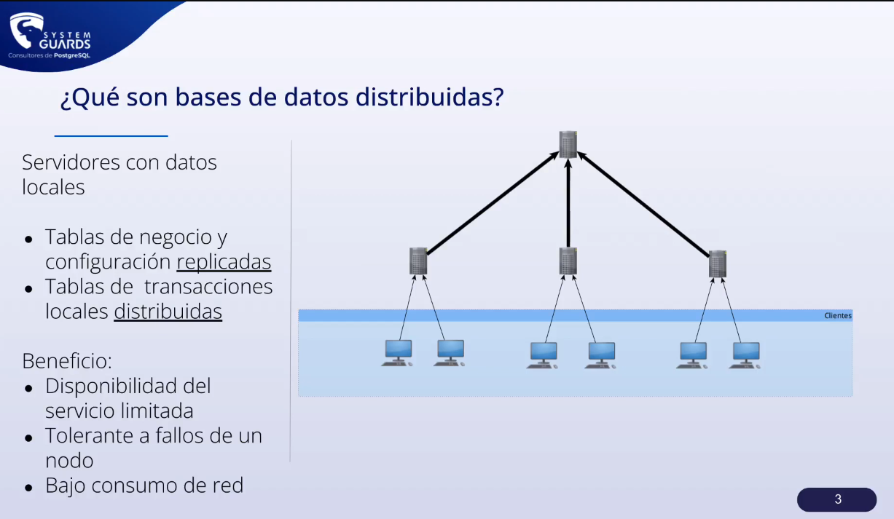
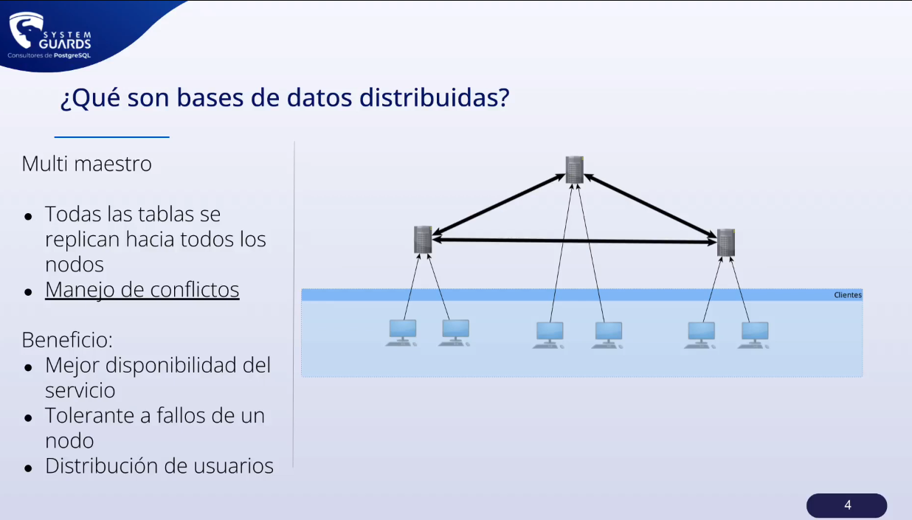
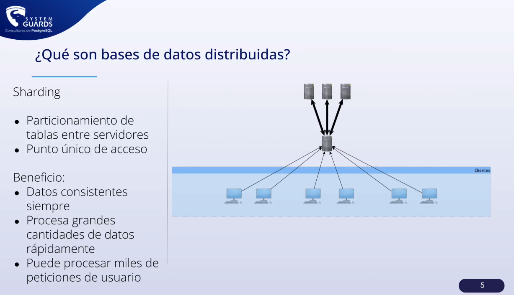
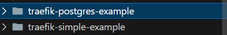

# Clase #5 - Introducción a las bases de datos distribuidas

En esta clase se abordaran los siguientes temas:

- Definición y características de los sistemas distribuidos.
- Teorema CAP.
- Tipos de arquitectura distribuida: cliente-servidor, peer-to-peer.
- Ventajas y desafíos de los sistemas distribuidos.
- Modelos de consistencia en sistemas distribuidos.
- Algoritmos de consenso distribuidos.
- Gestión de fallos en sistemas distribuidos.
- Casos de uso de bases de datos distribuidas.
- Introducción a bases de datos distribuidas tomando como base conceptos iniciales.
    - Traefik 
    - Docker Compose
    - Postgres con pgAdmin    


## Créditos y referencias

Primero que nada la mayor del contenido aquí descrito, se extrajo del canal de youtube SystemGuards, el cual les invito a ver porque es bastante interesante en cuanto a la explicación de los conceptos de bases de datos distribuidas y postgres en general.

[](https://www.youtube.com/@systemguards7746)

## Definición y características de los sistemas distribuidos

Un sistema distribuido es un conjunto de computadoras interconectadas que se comunican entre sí a través de una red, con el objetivo de compartir recursos y trabajar de manera coordinada para realizar una tarea en común. Los sistemas distribuidos se caracterizan por ser escalables, tolerantes a fallos, y permitir el acceso concurrente a los recursos compartidos.

[Enlace a vídeo de youtube](https://www.youtube.com/watch?v=5SZVJgg94k4&list=PL3Gn_A93oIjvnEOnuBi5f_4KDrt7PabkS&index=8)

## Tipos de arquitectura distribuida

### Arquitectura jerárquica distribuida / Sistema distribuido con replicación y partición local
Es la única que se puede lograr con postgres nativo, pero no es la mejor opción para bases de datos distribuidas. Los nodos superiores suelen actuar como coordinadores o servidores maestros, mientras que los inferiores contienen datos o realizan tareas específicas.




### Multi-Master
En este tipo de arquitectura, todos los nodos pueden aceptar lecturas y escrituras, lo que permite una alta disponibilidad y tolerancia a fallos. Sin embargo, la sincronización de los datos entre los nodos puede ser un desafío, ya que se requiere un mecanismo de replicación bidireccional.



### Sharding
En este tipo de arquitectura, los datos se dividen en fragmentos o particiones que se distribuyen entre varios nodos. Cada nodo es responsable de un subconjunto de los datos, lo que permite una mayor escalabilidad y rendimiento. Sin embargo, la coordinación de las consultas que abarcan múltiples fragmentos puede ser un desafío, ya que se requiere un mecanismo de enrutamiento y coordinación.

Nota: ojo en ejemplos futuros y término pgcat. **Punto único de acceso: Existe un servidor central o middleware que dirige las peticiones al "shard" correcto.**




## Teorema CAP

El Teorema CAP (también llamado Teorema de Brewer) establece que en un sistema de bases de datos distribuidas, es imposible garantizar simultáneamente las tres siguientes propiedades al mismo tiempo:

1. Consistencia (C): Todos los nodos del sistema ven los mismos datos al mismo tiempo. Es decir, después de una operación de escritura, cualquier lectura devolverá el valor más reciente.

2. Disponibilidad (A): Cada solicitud (lectura o escritura) recibe una respuesta, incluso si algunos nodos están caídos.

3. Tolerancia a particiones (P): El sistema continúa funcionando a pesar de fallos en la red que dividen el sistema en partes (particiones).

**El teorema establece que un sistema distribuido puede cumplir a lo sumo dos de estas propiedades al mismo tiempo, pero no las tres.**

<div align="center">

### Tabla de comparación de las propiedades CA, CP y AP:

</div>

| **Propiedad**          | **CA (Consistencia y Disponibilidad)**           | **CP (Consistencia y Tolerancia a Particiones)** | **AP (Disponibilidad y Tolerancia a Particiones)** |
|-------------------------|-------------------------------------------------|------------------------------------------------|--------------------------------------------------|
| **Consistencia**        | Garantizada entre todos los nodos.              | Garantizada entre todos los nodos.             | Eventual (puede haber inconsistencias temporales). |
| **Disponibilidad**      | Siempre disponible mientras no haya particiones.| No garantizada durante particiones de red.     | Siempre disponible para operaciones.              |
| **Tolerancia a Particiones** | No tolera fallos de red.                      | Tolerante a fallos de red.                     | Tolerante a fallos de red.                        |
| **Casos de uso**        | Sistemas en red local, sin fallos frecuentes.   | Finanzas, bancos, sistemas críticos que requieren consistencia estricta. | Redes sociales, streaming, sistemas con alta demanda y escalabilidad horizontal. |
| **Ejemplos**            | RDBMS tradicionales en red local.               | MongoDB (modo fuerte), HBase, Zookeeper.       | Cassandra, DynamoDB, Couchbase.                  |


## Ejemplo práctico de introducción para bases de datos distribuidas

En esta clase se realizará un ejemplo práctico utilizando Traefik, Docker Compose, Postgres y pgAdmin. El objetivo es entender como funciona un sistema distribuido con sus complementos de orquestación y balanceo de carga. Previo a crear una base de datos distribuida es imporante conocer los conceptos (Proxy, orquestador, balanceador de carga, etc) que se utilizarán para hacer uso de las bases de datos distribuidas. Tomar muy en cuenta estos conceptos para poder entender como aplicar las bdd como solución a problemas de un índole real.

- **Proxy**: Un proxy es un intermediario que se ubica en la comunicación entre un cliente y un servidor. Se encarga de recibir las peticiones del cliente y reenviarlas al servidor (o a otro servicio), y luego devolver la respuesta del servidor al cliente.

    - **Objetivo principal**: Aislar o abstraer la comunicación directa entre cliente y servidor.

- **Forward Proxy: el proxy “clásico”**: Cuando en el día a día se habla de “usar un proxy” (sin más contexto), normalmente se refieren a un forward proxy. 

    - **¿Quién lo usa?** El cliente (ej: tu navegador) se conecta al proxy. Luego, el proxy se conecta a internet (o al servidor destino) en nombre del cliente.

- **Reverse Proxy: el intermediario “protector” del servidor**: Un reverse proxy se ubica “del lado del servidor” pero cumple una función parecida de intermediario.

    * seguridad (firewall)
    * balanceo de carga
    * caché / compresión
    * TSL/SSL

    - **¿Quién lo usa?** En este caso, el servidor configura el reverse proxy para que sea la “cara pública” de sus servicios.

- **API Gateway**: Cuando escuchas “API Gateway” en el contexto de aplicaciones web, usualmente se trata de un componente que encapsula la lógica de enrutamiento hacia diferentes microservicios y añade funciones de gestión de tráfico, seguridad, métricas, etc.

    - Puede comportarse como un reverse proxy que distribuye las peticiones a distintos servicios.

    - Suele agregar funcionalidades de autentificación, rate-limiting, logging o transformación de datos (parecido a un middleware).

- **Middleware**: El middleware es un concepto más amplio que no se refiere estrictamente a la parte de red/protocolos entre cliente y servidor. Se utiliza para describir cualquier capa de software que se ubique “en medio” de otras capas o componentes para agregar funcionalidad, realizar transformaciones, o gestionar la comunicación.

- **Balanceador de carga**: Un balanceador de carga es un dispositivo o software que distribuye el tráfico entre varios servidores para mejorar la disponibilidad y el rendimiento de una aplicación. El balanceador de carga puede distribuir el tráfico de manera equitativa entre los servidores, o utilizar algoritmos más avanzados para optimizar la distribución del tráfico.

    - **Objetivo principal**: Distribuir el tráfico entre varios servidores para mejorar la disponibilidad y el rendimiento de una aplicación.

- **Docker Compose**: Docker Compose es una herramienta que permite definir y ejecutar aplicaciones multi-contenedor de Docker. Con Compose, se define una aplicación en un archivo YAML, que luego se utiliza para crear y arrancar los servicios de la aplicación.

- **Traefik**: Traefik es un proxy inverso y balanceador de carga que se utiliza para enrutar el tráfico entre los contenedores de una aplicación. Traefik es compatible con Docker y otros orquestadores de contenedores, y se configura a través de etiquetas en los contenedores.


Para ello, se seguirán los siguientes pasos:

1. Copiar ambas carpetas en sus dispositivos locales.



y ejecutar el comando para levantar los contendores (en los archivos .yml se encuentran las configuraciones necesarias para levantar los contenedores y sus explicaciones).:

```bash
docker compose up -d
```

para más detalle revisar el [siguiente enlace](https://blog.faizahmed.in/how-much-do-you-know-traefik-proxy) 

que ayuda mucho para comprender las fundamentos de los siguientes ejemplos de bases de datos distribuidas.

