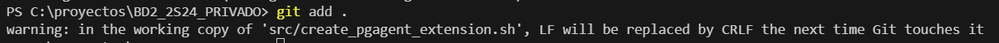

# GUIDE_TO_DATABASES_BD2_2S24

## Mensaje de bienvenida

Bienvenidos al laboratorio del curso de Bases de Datos 2 del segundo semestre de 2024 en la Universidad de San Carlos de Guatemala. Este repositorio es una guía completa para navegar por los contenidos de las bases de datos. 📚✨

En este semestre, nos adentraremos en el fascinante mundo de las bases de datos avanzadas. Exploraremos desde los conceptos iniciales hasta los sistemas distribuidos y las bases de datos NoSQL, incluyendo MongoDB, Apache Cassandra, Redis y Neo4j. También, entenderemos la importancia de la transaccionalidad, el respaldo y la recuperación de datos, y finalizaremos con una introducción a las bases de datos multidimensionales. 🚀💡

¿Qué veremos en este curso?
* Conceptos iniciales: Normalización, funciones y procesos básicos.
* Transaccionalidad: Concurrencia, PL-SQL y T-SQL.
* Respaldo y recuperación: Full backups, backups incrementales y diferenciales.
* Sistemas distribuidos: Tipos, ventajas, desventajas y réplicas.
* Bases de datos NoSQL: Modelo NoSQL, estructuras de datos y el teorema CAP.
* MongoDB: Modelado de datos, replicación y consultas.
* Apache Cassandra: Clústeres, tipos de llaves y consultas.
* Redis: Estructura de datos y modelado.
* Neo4j: Bases de datos orientadas a grafos y modelo ACID.
* Bases de datos multidimensionales: Datawarehouse, Datamart y Datamining.

Este curso está diseñado para que adquieran un entendimiento profundo y práctico de cada uno de estos temas, mediante proyectos, ejercicios y presentaciones adjuntas. 🎓💬

**Nota (Git - por si alguien desea hacer un repo similar):** Configurar git por cualquier cambio de los archivos .sh ya que realiza un por defecto un cambio en los caracteres "LF" a "CRLF" que puede ocasionar problemas en los scripts que se ejecutan para bash en los contenedores.

Solución:

1. Crear o Editar el Archivo .gitattributes:

    ``touch .gitattributes``

2. Añadir Configuración para Archivos de Scripts:

    ``*.sh text eol=lf``

Esta configuración le dice a Git que trate todos los archivos .sh como texto y que convierta los finales de línea a LF cuando se realicen checkouts en sistemas Unix/Linux.